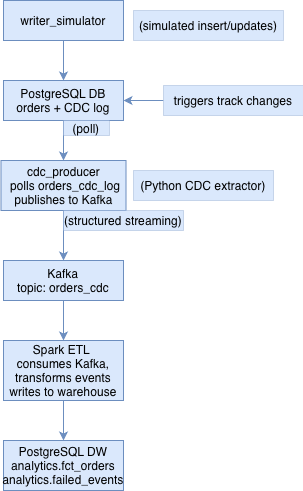

## Real-Time CDC ETL Pipeline (Python + Spark + Kafka + Postgres)

This repository contains an end-to-end real-time ETL pipeline implementing Change Data Capture (CDC) with:

- **PostgreSQL** as the source database  
- **Custom CDC** using SQL triggers + polling  
- **Kafka** as the message queue  
- **Apache Spark (PySpark)** for streaming ETL  
- **PostgreSQL (analytics schema)** as the warehouse sink  
- **Docker Compose** for full local deployment

This project implements the coding challenge from Aladia and is designed to be modular, scalable, and production-oriented.

---

### Architecture Overview
<div align="center">


</div>

---

### Components
#### Source Database
- PostgreSQL stores:
  - `orders`
  - `orders_cdc_log` (tracking row-level changes)
- CDC log is maintained via database triggers.

#### CDC Producer (Python)
- Polls `orders_cdc_log` for new changes.
- Converts each row into a JSON event.
- Pushes to Kafka (`orders_cdc` topic).
- Handles:
  - Retry logic  
  - Reconnection  
  - At-least-once delivery  

#### Kafka Message Queue
- Decouples producers from consumers.
- Provides durability and ordering guarantees.
- Allows event replay for debugging or backfills.

#### Spark Structured Streaming (PySpark)
- Reads from Kafka in microbatches.
- Parses JSON CDC messages.
- Performs an idempotent upsert using version column:
  ```sql
  ON CONFLICT (order_id) DO UPDATE ... 
  WHERE excluded.version > fct_orders.version
  ```
- Writes failures (malformed rows, DB issues) to:
`analytics.failed_events`.

#### Data Warehouse Sink
- PostgreSQL (separate schema: `analytics`)
- Star-like fact table:
    - `fct_order` (latest order state)
    - `failed_events` (bad records, diagnostics)
---
### Setup & Running (Docker Compose)
#### 1. Clone the repository
```bash
git clone https://github.com/ivonani/aladia-cdc-pipeline.git
cd aladia-cdc-pipeline
```
#### 2. Start the entire stack
```bash
docker compose up -d
```
#### 3. Verify components
Check running containers:
```bash
docker compose ps
```
Kafka topic:
```bash
docker exec -it aladia-cdc-pipeline-kafka-1 kafka-topics --bootstrap-server localhost:9092 --list
```
Check data in warehouse:
```bash
docker exec -it aladia-cdc-pipeline-postgres-1 psql -U app -d appdb
```
---

### Testing the Pipeline
#### 1. Writer simulator generates new orders
Automatically inserts and updates orders every 2 seconds.
#### 2. CDC producer publishes CDC events
Check logs:
```bash
docker logs aladia-cdc-pipeline-cdc-producer-1 | tail -n 20
```
#### 3. Kafka receives all CDC events
```bash
docker exec -it aladia-cdc-pipeline-kafka-1 bash

kafka-console-consumer \
  --bootstrap-server localhost:9092 \
  --topic orders_cdc \
  --from-beginning \
  --max-messages 5
```
#### 4. Spark consumes and writes to warehouse
```bash
docker logs aladia-cdc-pipeline-spark-1 | tail -n 100
```
Check transformed data:
```sql
SELECT COUNT(*) FROM analytics.fct_orders;
SELECT * FROM analytics.failed_events LIMIT 20;
```
---

### Design Choices & Trade-offs
#### Custom CDC vs Debezium
✔ No external dependencies
✔ Transparent + easy to debug
✘ Higher latency due to polling
✘ Works only for uniform schemas
#### Kafka for decoupling
✔ Allows replay
✔ Handles producer/consumer scaling
✔ Prevents DB → Spark tight coupling
#### Spark Structured Streaming
✔ Auto-handles microbatches
✔ Scales horizontally
✔ Integrates with Kafka natively
#### Postgres as warehouse
✔ Easy local testing
✔ Strong ACID guarantees
✔ Works well for upsert-heavy workloads

---
### Scaling Considerations
If traffic increases 10×, what breaks first?
#### 1. CDC polling
- Increase polling interval → latency grows
- Solution: switch to Debezium or logical decoding
#### 2. Kafka throughput
- Add partitions
- Run more Spark consumers
#### 3. Warehouse write contention
- Batched upserts
- Switch to analytical DB (BigQuery, Redshift, Snowflake)
#### 4. Spark driver memory
- Add checkpointing
- Decrease microbatch size
- Scale to cluster mode

---

### Testing & Observability
- All services log to stdout (visible via `docker logs`).
- Spark prints batch errors.
- Warehouse keeps `failed_events` table for investigation.
